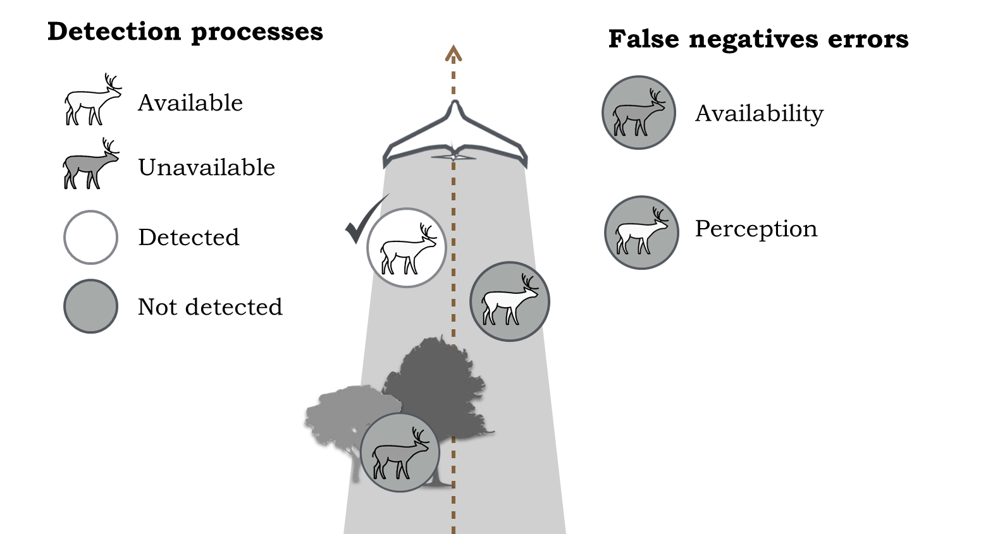
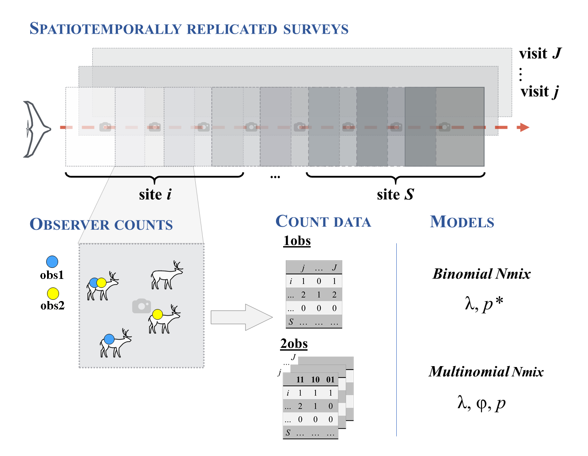

## Sampling design

Basic sampling design for N-mixture models consists in spatiotemporally replicated surveys, that is, multiple sites are surveyed in multiple visits. Sites of drone-based surveys can be derived from segments/stretches of flight lines. After fieldwork, drone collected imagery can be reviewed either by one or two observers (or maybe more..) so that each observer mark individuals on images.\
With this survey design, it is possible to estimate abundance while accounting for the two-common false-negative errors in aerial surveys: **availability and perception**. 


```{r, ,echo=F, out.width='60%', fig.align='center',fig.cap="Figure: False-negative detection errors in counts from drone-based surveys: i) individuals unavailable for detection; ii) detection failure by a human observer or algorithm given that it is available"}

```

\ 

```{r, ,echo=F, out.width='75%', fig.align='center',fig.cap="Figure: Spatiotemporally replicated drone-based surveys, resulting count data by either single or double observers, and N-mixture models"}

```

## N-mixture models

Resulting count data is a 2D array (sites x visits) for single observer counts or 3D array (sites x visits x observable encounter histories) for the double-observer protocol.\
This count data can be fitted using hierarchical N-mixture models.

### Single observer counts

**The single observer counts are fitted using a binomial N-mixture model.** (Royle 2004, *Biometrics*)


* $M_{i} \sim {\sf Poisson}(\lambda)$
* $Y_{i,j} \sim {\sf Binomial}(M_i, p^{*})$, where $p^{*} = \phi.p$

<font size="2"> 
$M_{i}$: Local abundance in sites {*i*...*S*} is governed by a mean local abundance $\lambda$\n

$Y_{i,j}$: Observer counts for each site *i* in each visit *j* is determined by the overall detection probability
$p^{*}$, that is the product of individuals availability $\phi$ and perception $p$
</font>

### Double-observer protocol

**Double observer counts are fitted using a Multinomial N-mixture model with a temporary emigration component** (Chandler, Royle, and King  2011, *Ecology*)

* $M_{i} \sim {\sf Poisson}(\lambda)$
* $N_{i,j} \sim {\sf Binomial}(M_i, \phi)$
* $Y_{i,j,k} \sim {\sf Multinomial}(N_{i,j}, \pi(p)_{k})$

<font size="2"> 
$M_{i}$: Local abundance in sites {*i*...*S*} is governed by a mean local abundance $\lambda$\n

$N_{i,j}$: Number of individuals available for detection in site *i* and visit *j* depends on an availability probability $\phi$\n

$Y_{i,j,k}$: Counts under each observable encounter history *k*, in each visit *j*, in each site *i*,  depends on the perception probability by each observer $p$ (*e.g.* $\pi_{10} = p(1-p)$ for detected by the 1st observer and not the 2nd)\n
</font>

### Mixed (single and double) protocols

A double-observer protocol can be applied in only a subset of the imagery and it is still possible to segregate availability and perception probabilities in the Multinomial N-mixture model.

