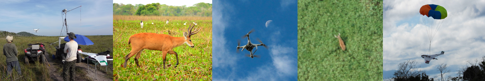

```{r, ,echo=F, out.width='90%', fig.align='left'}

```

## Performance and optimal design of N-mixture models for spatiotemporally replicated drone-based surveys

\ 

#### This website is provided as a supplemental material of the manuscript *Optimally designing drone surveys for wildlife abundance modeling with N-mixture models*, Brack I.V., Kindel A., Oliveira L.F.B., Lahoz-Monfort J.J. 2021.

\ 

In that study, we explore, in a very wide scan study with several scenarios, the performance and optimal survey effort allocation for hierarchical N-mixture models, focusing on their application for drone-based surveys.  We also investigate the use of a double observer protocol to decompose the detection process in availability and perception.\

We specifically addressed three aspects:

  1. **optimal design of count surveys for N-mixture abundance estimation**
  2. **exploring the benefit of the double-observer protocol**
  3. **reducing fieldwork effort by employing a double-observer protocol**

This website contains:

- [a basic explanation of the required sampling design and (binomial and multinomial) N-mixture models](designANDmodels.html)
- [an interactive tool to run single examples with customizable scenario and survey - design](runExample.html)
- [visualize the simulation results on the performance and optimal survey design for predefined scenarios](simul_results.html)

\ 

Codes (`R`) to reproduce the same results or explore other scenarios are available at the [GitHub repo](https://github.com/ismaelvbrack/designNmix4droneSurveys).\
We also provide codes to fit the models with the `unmarked` `R` package using maximum likelihood estimation and `JAGS` codes for Bayesian analysis.

For more details of the simulation study, check the paper!


