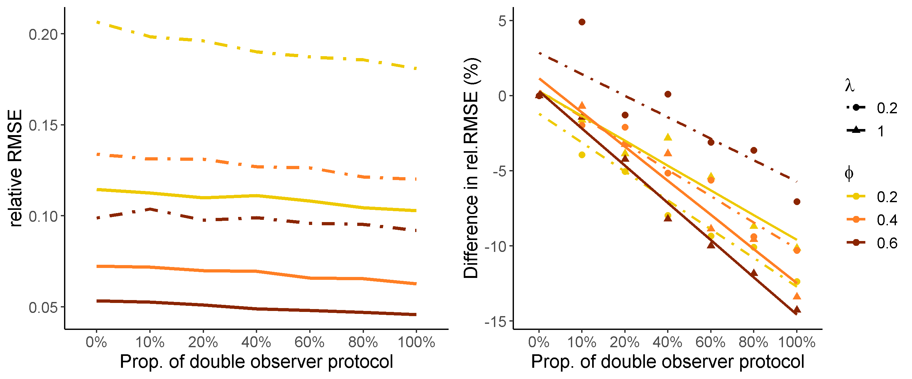
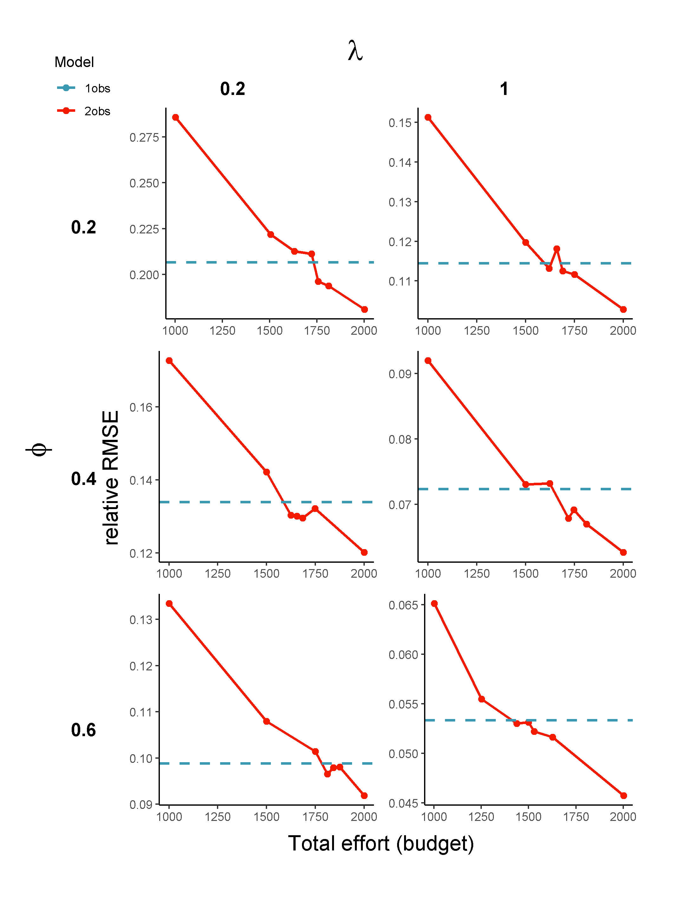
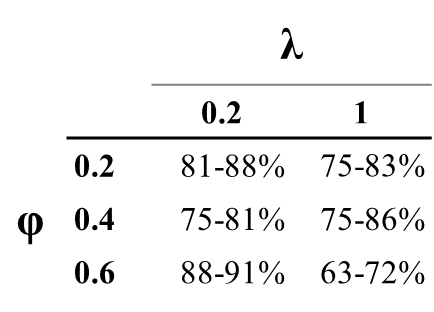

```{r include=F}
library(shiny)
library(widgetframe)
```

### N-mixture model performance and optimal survey design

Choose a scenario of local abundance in sites $\lambda$ and individual availability probability $\phi$ to see single and double observer models performance (relative RMSE curves) and optimal survey effort allocation (optimal number of visits).

\ 
<iframe height="1500" width="110%" frameborder="no" 
src="https://ismaelbrack.shinyapps.io/simulNmix_results/"> </iframe>
\ 

\ 

### Improving accuracy in abundance estimation by using a double-observer protocol

Increase in model accuracy by using a double-observer protocol when compared to a single observer model (as a baseline).

```{r, ,echo=F, out.width='90%', fig.align='center',fig.cap="Figure: Increase in model performance with the proportion of a double-observer protocol in image review"}

```

\ 

### Reducing fieldwork effort with double observer review

Proportional reduction in fieldwork effort (from $B=2000$ flights) that can be achieved with a full double-observer protocol, while matching the same accuracy of the single observer model (for $p=0.8$).

```{r, ,echo=F, out.width='75%', fig.align='center'}

```

\  

```{r, ,echo=F, out.width='25%', fig.align='center', fig.cap="Proportion of the total effort (budget) of the double observer model (multinomial N-mixture) needed to obtain a similar performance to the single observer model (binomial N-mixture)"}

```


\  

\  

<font size="2"> 
For more details on the simulation methods and results check out the original paper. 
</font>


